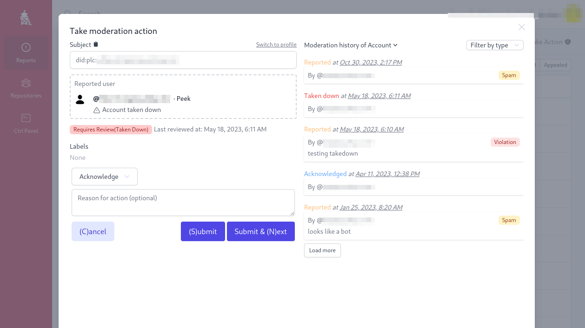

# Ozone: labeling service for Bluesky and other atproto apps

Ozone UI is a Next.js web application which talks directly to an Ozone "labeling service". It generally requires moderator or administrator privileges to function.

Features:

- viewing, triaging, escalating, and actioning moderation reports
- takedowns and suspension of content and accounts
- creating and modifying labels on content and accounts
- viewing invite trees and disabling invite generation
- sending moderation emails, based on templates
- browsing app.bsky profiles and post threads, including some taken-down content
- quick-action modal (Ctrl-K)

See [User Guide](./docs/userguide.md) for a quick introduction for users of the interface.

## Quickstart

You can self-host Ozone to run your own moderation service. Start with [HOSTING.md](./HOSTING.md). This will produce a Dockerized setup for hosting the Ozone UI and backend together.

See [HACKING.md](./HACKING.md) for local development requirements, like development with a local PDS instance, or working with un-released changes to the `@atproto/api` package.

## Contributions

> While we do accept contributions, we prioritize high quality issues and pull requests. Adhering to the below guidelines will ensure a more timely review.

**Rules:**

- We may not respond to your issue or PR.
- We may close an issue or PR without much feedback.
- We may lock discussions or contributions if our attention is getting DDOSed.
- We do not provide support for build issues.

**Guidelines:**

- Check for existing issues before filing a new one, please.
- Open an issue and give some time for discussion before submitting a PR.
- If submitting a PR that includes a lexicon change, please get sign off on the lexicon change _before_ doing the implementation.
- Issues are for bugs & feature requests related to the TypeScript implementation of atproto and related services.
  - For high-level discussions, please use the [Discussion Forum](https://github.com/bluesky-social/atproto/discussions).
- Stay away from PRs that:
  - Refactor large parts of the codebase
  - Add entirely new features without prior discussion
  - Change the tooling or frameworks used without prior discussion
  - Introduce new unnecessary dependencies

Remember, we serve a wide community of users. Our day-to-day involves us constantly asking "which top priority is our top priority." If you submit well-written PRs that solve problems concisely, that's an awesome contribution. Otherwise, as much as we'd love to accept your ideas and contributions, we really don't have the bandwidth.

## Security disclosures

If you discover any security issues, please send an email to security@bsky.app. The email is automatically CCed to the entire team, and we'll respond promptly. See [SECURITY.md](https://github.com/bluesky-social/atproto/blob/main/SECURITY.md) for more info.

## License

This project is dual-licensed under MIT and Apache 2.0 terms:

- MIT License ([LICENSE-MIT](https://github.com/bluesky-social/ozone/blob/main/LICENSE-MIT) or <http://opensource.org/licenses/MIT>)
- Apache License, Version 2.0, ([LICENSE-APACHE](https://github.com/bluesky-social/ozone/blob/main/LICENSE-APACHE) or <http://www.apache.org/licenses/LICENSE-2.0>)

Downstream projects and end users may chose either license individually, or both together, at their discretion. The motivation for this dual-licensing is the additional software patent assurance provided by Apache 2.0.

Bluesky Social PBC has committed to a software patent non-aggression pledge. For details see [the original announcement](https://bsky.social/about/blog/10-01-2025-patent-pledge).

## Acknowledgements

Logo/Icon from Flaticon: https://www.flaticon.com/free-icons/lifeguard-tower
