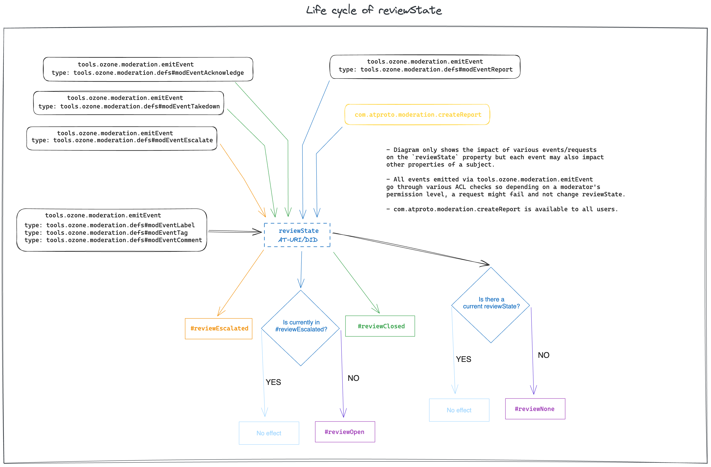
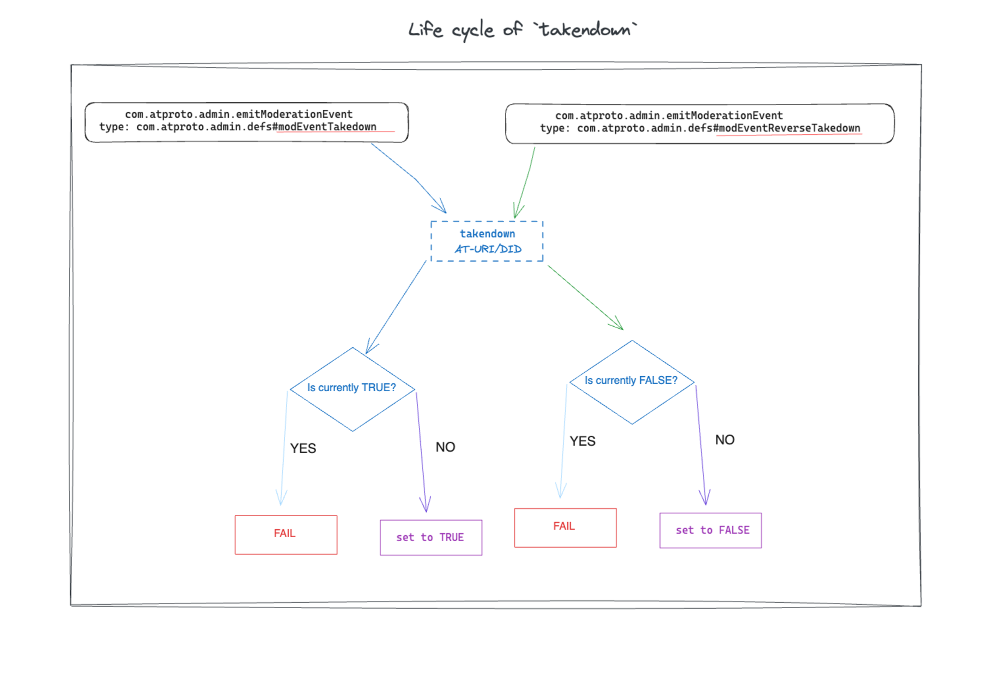

Ozone HTTP API Overview
=======================

Ozone is a labeling and moderation system for atproto. Similar to how Bluesky Social is an application built on top of atproto, and specified with the `app.bsky.*` Lexicon namespace, the Ozone system is built on top of atproto and uses the `tools.ozone.*` namespace. Ozone is not specific to Bluesky, and Ozone is not the only labeling/moderation system that could be built for atproto.

This document is an overview of the API used to communicate between the Ozone backend service (which is open source software and run separately by every independent moderation service), the Ozone web interface (”Ozone UI”), automod tools, and any additional script and tools which speak the API.

While most content in the atproto network is public, most data in Ozone is private to that individual instance. The main exception is Labels, which are usually distributed publicly. 

## Concepts

The Ozone system revolves around a few core concepts:

**Subjects** can be either entire accounts (referenced by a DID), or individual pieces of content (referenced by an AT-URI, and possibly a CID to specify which version). Note that an account profile record (including description, avatar, etc) is a distinct subject from the overall account. Subjects have state, are impacted by events, and can be reported.

**Events** include reports, actions (such as adding labels), and some team-internal workflow helpers like escalation and acknowledgement. Every event has a subject (which it is about) and a creator (the account who caused the event). Events can update the state of a subject, and every subject has an ordered history of events related to it.

**Reports** are a specific type of event. They are usually created by users of an app, and get routed to a specific moderation service based on the user's preferences. A special type of report is an *Appeal*, when an account reports itself in response to a moderation intervention.

**Queues** are dynamic lists of subjects in a given state, possibly filtered down by other metadata. They are the request of calls to the `tools.ozone.moderation.querySubjects` API endpoint.

## Subject State

Subjects have a few independent “state” properties at any point in time. Every change in those properties is caused by an event. The current state is the result of integrating all historical events.

Let’s look at each of the currently implemented state properties.

### `reviewState`

Represents where the subject is in the cycle of being reported and reviewed. The allowed state values are:

`reviewOpen`: Any incoming report on a subject will change the subject’s state to this (unless the subject is already in `reviewOpen` or `reviewEscalated` state). All reports in this state are displayed in reverse chronological order to our moderators, by default.

`reviewEscalated`: A moderator, upon reviewing incoming reports, may decide to escalate for the subject to be reviewed by higher tier moderators.

`reviewClosed`: Upon reviewing all reports, a moderator may “acknowledge” with or without taking any action (such as label, leave a comment for the future etc.) on the subject and move the subject to this state. New reports in the future will move the subject back to `reviewOpen` state.

`reviewNone`: At times, we want to store various metadata on a subject such as tags or comments by a human or an automated process. Subjects in such a state do not require further human review.

### `muted`

A boolean state value indicating that the subject should be excluded from moderation queues for a fixed time period (eg, hours). Team members can mute a subject which is being re-reported frequently to prevent it from cluttering the “unreviewed” queue. Which essentially takes the subject out of the default queue and it will only reappear after the selected period during the mute action. Moderators may also “unmute” an already muted subject at will.

### `appealed`

Boolean value representing that the author of the subject has appealed a moderation decision. An appeal request also changes the subject's `reviewState` to `reviewOpen`. A moderator will have to explicitly take the “Resolve Appeal” action for this state to change.

### `takendown`

Boolean value representing that a moderator decided to either temporarily or permanently takedown the subject. Temporary takedowns/suspensions are automatically reversed after the selected suspension period and permanently taken down subjects can also be reversed through a “Reverse Takedown” action.

*Note: muted and appealed properties follow an almost identical state-flow.*

## **Queues**

All subjects that ever received a report or been “moderated” can be queried using the `tools.ozone.moderation.queryStatuses` endpoint, which is essentially what is used to build the moderation queue for our moderators. The queue can be filtered/sorted using a variety of parameters which allows one to look at subjects that require review or appeals from users or only escalated subjects etc.

By default, the queue will ignore all muted subjects but this can be overridden by the `includeMuted` parameter.

## **Events**

As mentioned above, all user reports/moderator actions are tracked through moderation events. A moderator taking an action always triggers a call to `tools.ozone.moderation.emitEvent` and all historical events can be queried using `tools.ozone.moderation.queryEvents`  which also allows various filters to slice the dataset.

One of the most useful parameters accepted by `tools.ozone.moderation.queryEvents`  is `includeAllUserRecords` combined with `subject` which allows us to retrieve all moderation events for all content/subjects belonging to a user (represented by their DID). This is immensely helpful to provide useful context to moderators when reviewing any reports. A single piece of content in isolation may seem harmless but in context of all other reports and previously taken actions by moderators on the user’s account/content draws a much clearer picture.

## **Access Control**

Keep in mind that while other lexicons under the `tools.ozone.*` namespace work for all users with an admin token, `tools.ozone.moderation.emitEvent` checks user’s role/access level before actually letting an event through and allowing it to impact the state of a subject. As of now, we have 3 defined roles: triage, moderator and admin and these roles are used to ensure that only the people with certain roles can perform certain actions. For example, only a moderator/admin can take down or label a subject but triage roles can’t
